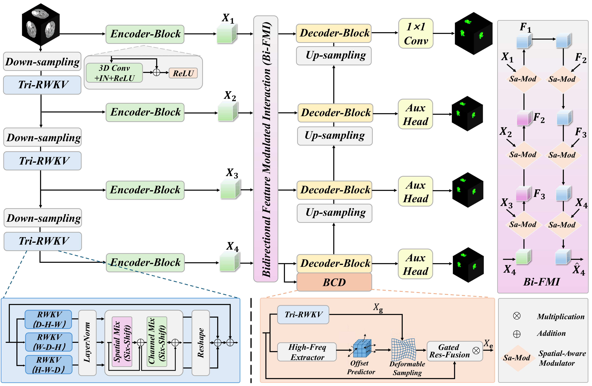
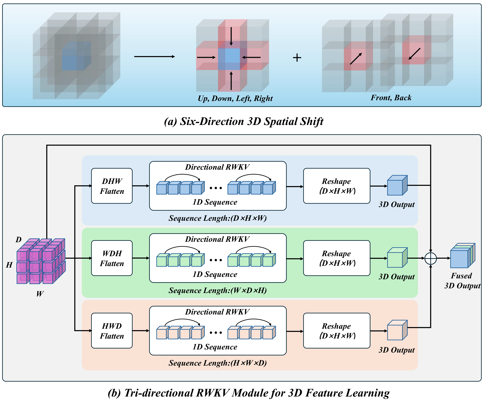
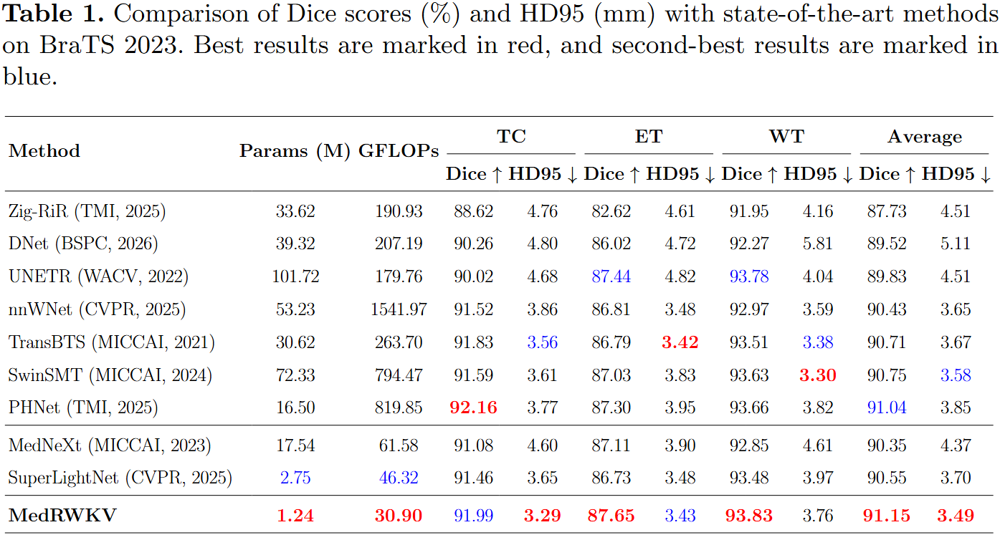
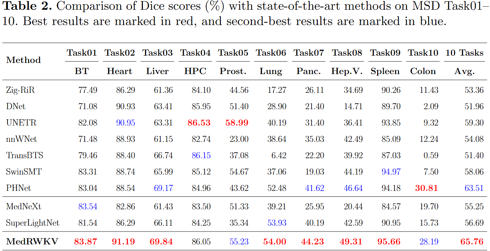
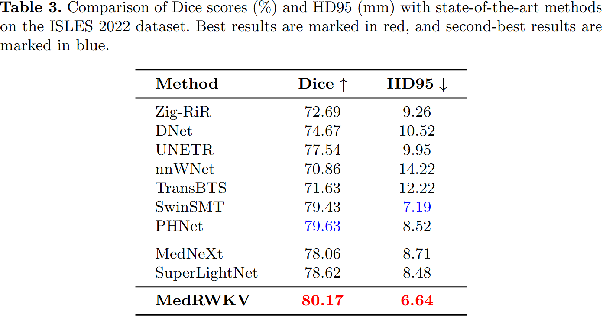
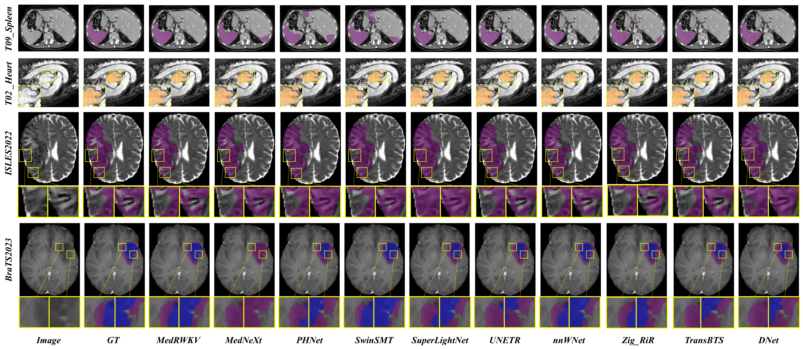

# MedRWKV: Tri-Directional RWKV with Deformable Fusion for 3D Medical Image Segmentation

> **Paper Title:** MedRWKV: Tri-Directional RWKV with Deformable Fusion for 3D Medical Image Segmentation
>
> **Conference:** PRCV 2026
>
> **Status:** 🟢 Under Review


---
## 📰 News

- **[2026-5-30]**  🔥 Paper submitted to PRCV 2026.

---

## 📌 Overview

Accurate 3D medical image segmentation remains challenging due to blurred boundaries, irregular lesion morphology, large inter-patient variation, and the high computational cost of volumetric context modeling.

To address these challenges, we propose **MedRWKV**, a lightweight 3D encoder-decoder segmentation network that integrates efficient long-range dependency modeling and boundary-aware deformable feature fusion.

The core idea is to combine:

1. **Tri-Directional 3D RWKV modeling** for efficient volumetric global context extraction.
2. **Boundary-driven deformable fusion** to align global semantic representations with local boundary-sensitive features.
3. **Hierarchical feature interaction** for bidirectional semantic-detail communication across multiple encoder stages.

---

## ✨ Key Contributions

- **Tri-Directional RWKV for 3D Volumes**  
  We extend Vision-RWKV to volumetric medical image segmentation by scanning 3D features along multiple spatial orders, enabling efficient long-range dependency modeling while reducing directional bias.

- **Boundary-Driven Deformable Fusion**  
  We introduce a boundary-aware deformable fusion module that extracts high-frequency boundary cues, predicts spatial offsets, and adaptively aligns global RWKV features with local convolutional features.

- **Hierarchical Semantic-Spatial Interaction**  
  A bidirectional feature interaction mechanism is adopted to perform top-down semantic guidance and bottom-up detail refinement across multi-scale encoder features.

- **Lightweight 3D Segmentation Framework**  
  The network combines depthwise separable 3D convolutions, anisotropic downsampling, RWKV-based global modeling, and deep supervision for efficient volumetric segmentation.

---


## 🏗️ Framework Architecture

The overall framework follows a U-shaped encoder-decoder structure.

<p align="center">
  
</p>

<p align="center">
  <em>Overall architecture of MedRWKV.</em>
</p>


## 🧩 Tri-Directional RWKV Design

The proposed Tri-Directional RWKV module captures volumetric long-range dependencies through six-direction 3D spatial shift and multi-order directional sequence modeling.

<p align="center">
  
</p>

<p align="center">
  <em>Detailed design of the Tri-Directional RWKV module.</em>
</p>


## 📊 Results & Visualization

### 1. Quantitative Comparison

<p align="center">
  
</p>


<p align="center">
  
</p>


<p align="center">
  
</p>


### 2. Qualitative Visualization

<p align="center">
  
</p>

<p align="center">
  <em>Visualization examples of segmentation results by different methods on
BraTS2023, MSD Task02, MSD Task09, and ISLES2022 datasets.</em>
</p>


## 📦 Data downloading

### ISLES 2022
 
Data is from [https://www.kaggle.com/datasets/dearsayan/isles20222](https://www.kaggle.com/datasets/dearsayan/isles20222)

The data structure will be in this format:

```text
data/
└── derivatives/
    ├── sub-strokecase0001/
    │   ├── ses-0001
    │         ├── ant
    │             ├── sub-strokecase0001_ses-0001_FLAIR.nii.gz
    │         ├── dwi
    │             ├── sub-strokecase0001_ses-0001_adc.nii.gz
    │             ├── sub-strokecase0001_ses-0001_dwi.nii.gz
    ├── sub-strokecase0002/
    │   └── ...
    ├── sub-strokecase0003/
    │   └── ...
    ├── dataset_description.json
    └── README
```


### BraTS 2023

Data of BraTS 2023 is from [https://www.synapse.org/Synapse:syn51156910/wiki/621282](https://www.synapse.org/Synapse:syn51156910/wiki/621282)

The BraTS 2023 structure will be in this format:

```text
data/
└── ASNR-MICCAI-BraTS2023-GLI-Challenge-TrainingData/
    ├── BraTS-GLI-00000-000/
    │   ├── BraTS-GLI-00000-000-seg.nii.gz
    │   ├── BraTS-GLI-00000-000-t1c.nii.gz
    │   ├── BraTS-GLI-00000-000-t1n.nii.gz
    │   ├── BraTS-GLI-00000-000-t2f.nii.gz
    │   └── BraTS-GLI-00000-000-t2w.nii.gz
    ├── BraTS-GLI-00002-000/
    │   └── ...
    ├── BraTS-GLI-00003-000/
    │   └── ...
    └── ...
```
### MSD Task01-Task10

Data is from http://medicaldecathlon.com/

For the needs of the experiment, we only need to organize Task01_BrainTumour into the following data structure (similar to BraTS 2023).
```text
data/
└── Task01_BrainTumour/
    ├── BRATS_001/
    │   ├── img.nii.gz
    │   └── seg.nii.gz
    ├── BRATS_002/
    │   ├── img.nii.gz
    │   └── seg.nii.gz
    ├── BRATS_003/
    │   ├── img.nii.gz
    │   └── seg.nii.gz
    ├── BRATS_004/
    │   └── ...
    ├── BRATS_005/
    │   └── ...
    └── ...
```

## ⚡ Environment install
### Configuring your environment

Creating a virtual environment in terminal: conda create -n MedRWKV python=3.12

Enter the environment: conda activate MedRWKV

Install the necessary packages: 
```bash
pip install torch==2.5.1 torchvision==0.20.1 torchaudio==2.5.1 --index-url https://download.pytorch.org/whl/cu124
pip install -r requirements.txt
```
## 🚀  Preprocessing, training, and testing

 ### Brain Lesion - ISLES 2022, BraTS 2023 and MSD Task01
🆓 Preprocessing

The data directory of ISLES 2022 is : "./data/ISLES-2022/";

The data directory of BraTS 2023 is : "./data/ASNR-MICCAI-BraTS2023-GLI-Challenge-TrainingData/";

The data directory of MSD Task01 is : "./data/MSD_Task01/";

First, we need to run the renaming process and format reorganization. For ISLES 2022, the raw data will be reorganized into a standardized format in "./data/ISLES_Handle".

```bash 
python 1_reorganize_ISLES2022.py    or    python 1_rename_BraTS2023.py    or    python 1_rename_MSD_Task01.py
```

Then, we need to run the pre-processing code to do resample, normalization, and crop processes.

```bash
python 2_preprocessing_ISLES2022.py    or    python 2_preprocessing_BraTS2023.py    or    python 2_preprocessing_MSD_Task01.py
```

#### 🆓 Training 

When the pre-processing process is done, we can train our model.

**Dataset Splits**
| Dataset / Task                 | Test list path / Notes                                                                 |
|--------------------------------|---------------------------------------------------------------------------------------|
| ISLES 2022                      | `./ISLES2022/data/test_list.py` 
| BraTS 2023                      | `./BraTS2023/data/test_list.py`                                                     |
| MSD Task01                      | `./MSD_Task01/data/test_list.py`


We mainly use the pre-processde data from last step: **data_dir = ./data/train_fullres_process**


```bash 
python 3_train.py
```

#### 🆓 Testing

When we have trained our models, we can inference all the data in testing set.

We mainly use the pre-processde data from "Preprocessing" step: **data_dir = ./data/train_fullres_process**; 

The original data (**"./data/ISLES_Handle/" || ./data/ASNR-MICCAI-BraTS2023-GLI-Challenge-TrainingData/" || "./data/MSD_Task01/"**);

And the parameter you get from last step: **model_path = ./data/3D_parameter_ISLES2022/MedRWKV_ISLES2022.pth || ./data/3D_parameter_BraTS2023/MedRWKV_BraTS_2023.pth || ./data/3D_parameter_MSD_Task01/MedRWKV_MSD_Task01.pth**.

```bash 
python 4_predict_assemble.py
```

 ### Other organs -  MSD Task02-Task10

🆓 Training

The preprocessing process is embedded within the training process, we can train our model.

Choose the 'train' mode: parser.add_argument('--mode', type=str, default='train', help='Training or testing mode')
```bash 
python main_train_MSD_Task02_10.py
```

🆓 Testing
Choose the 'validation' mode: parser.add_argument('--mode', type=str, default='validation', help='Training or testing mode')

```bash 
python main_train_MSD_Task02_10.py
```