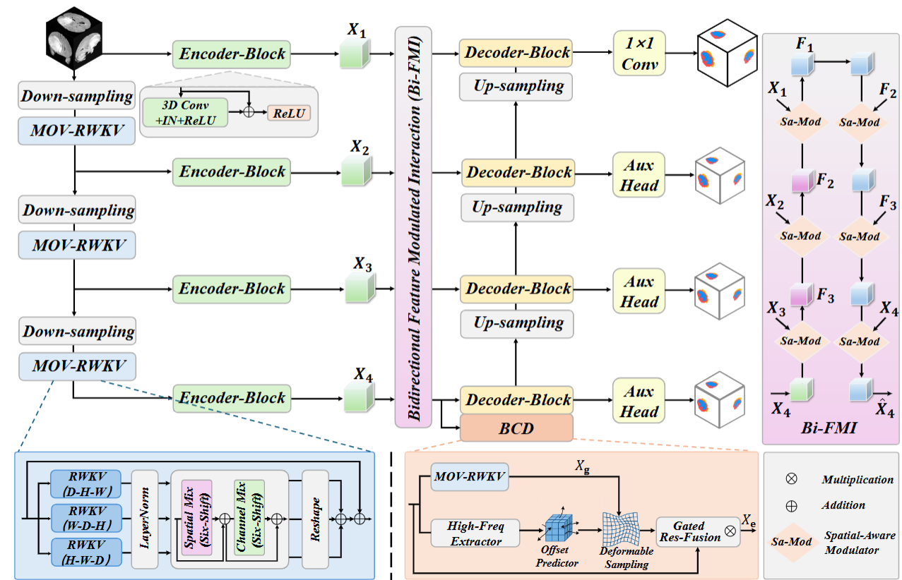
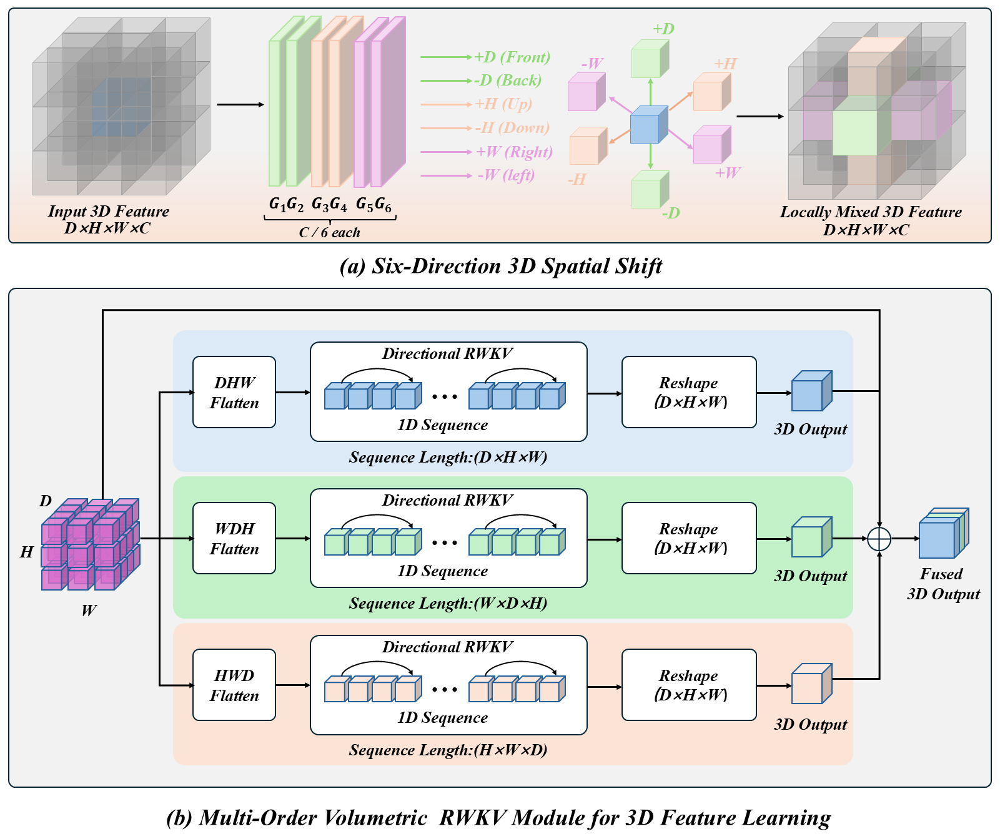
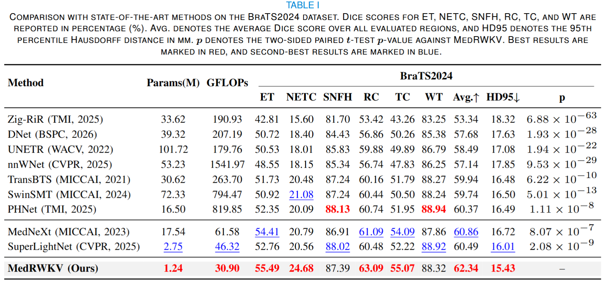
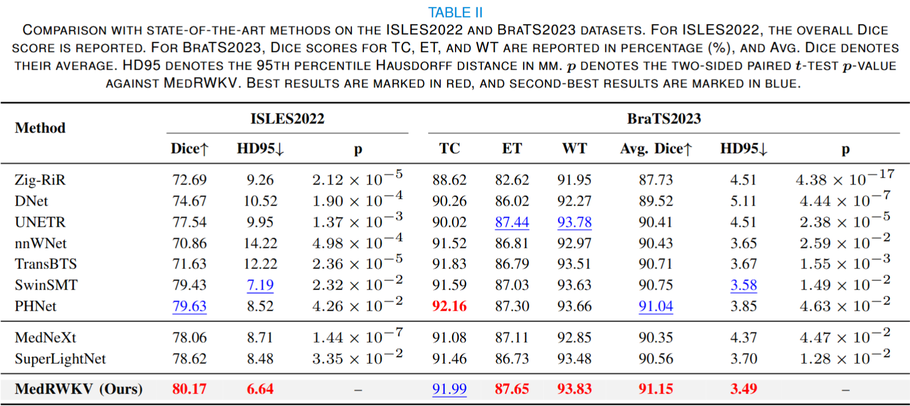
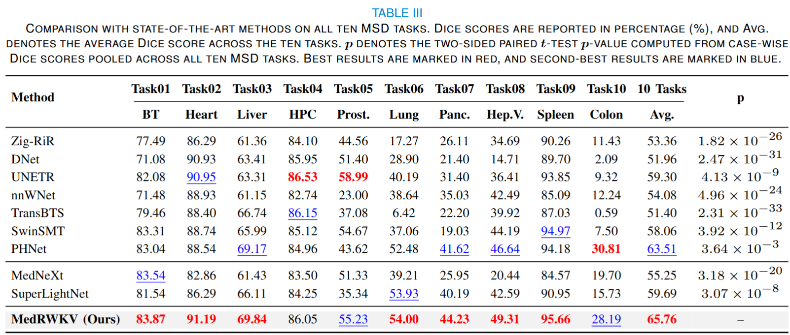
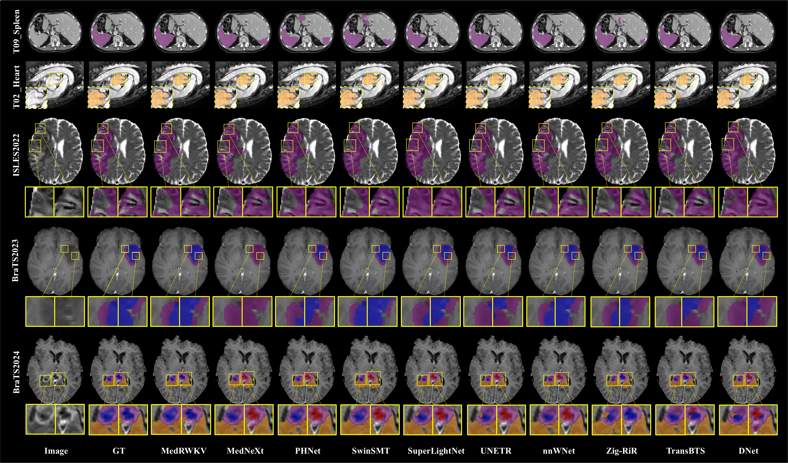
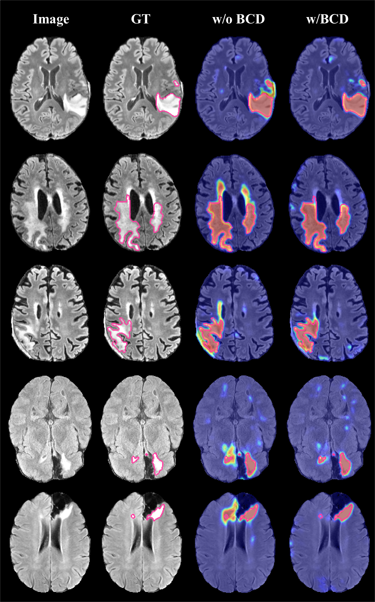

# MedRWKV: Multi-Order Volumetric RWKV with Deformable Fusion for 3D Medical Image Segmentation


---
## 📰 News

- **[2026-10-01]** 🔥 Paper submitted to **Elsevier，Information Fusion**.

---

## 📌 Overview

Accurate and efficient 3D medical image segmentation requires effective long-range volumetric modeling, cross-scale feature interaction, and precise boundary representation. However, existing methods still face several challenges: single-order sequence modeling may introduce serialization-order bias, conventional skip connections provide limited interaction between shallow spatial details and deep semantic representations, and successive downsampling may progressively erode fine-grained boundary information.

To address these challenges, we propose **MedRWKV**, a lightweight U-shaped 3D medical image segmentation framework that integrates:

1. **Multi-Order Volumetric RWKV (MOV-RWKV)** for linear-complexity long-range volumetric modeling.
2. **Bidirectional Feature Modulated Interaction (Bi-FMI)** for reciprocal semantic-detail interaction across multiple encoder stages.
3. **Boundary-driven Cross Deform (BCD)** for high-frequency-guided deformable sampling and boundary-sensitive feature refinement.
---

## ✨ Key Contributions

- **Multi-Order Volumetric RWKV (MOV-RWKV)**  
  We introduce a linear-complexity volumetric RWKV mechanism that models 3D features through three complementary serialization orders, including D-H-W, W-D-H, and H-W-D. Combined with six-direction 3D spatial shift, MOV-RWKV captures complementary volumetric context while alleviating single-order serialization bias.

- **Bidirectional Feature Modulated Interaction (Bi-FMI)**  
  We replace conventional direct skip connections with reciprocal cross-scale modulation. Deep semantic representations progressively refine shallow features, while shallow spatial details are propagated toward deeper representations for complementary semantic-detail integration.

- **Boundary-driven Cross Deform (BCD)**  
  We introduce a boundary-sensitive bottleneck module that extracts high-frequency cues to guide deformable feature sampling and boundary-aware gated fusion, improving ambiguous boundary representation without additional boundary supervision.

- **Lightweight and Generalizable Framework**  
  MedRWKV achieves a favorable accuracy-efficiency trade-off with only **1.24M parameters** and **30.90 GFLOPs**, and is extensively evaluated on **BraTS2024, BraTS2023, ISLES2022, and all ten MSD tasks**.
---


## 🏗️ Framework Architecture

MedRWKV adopts a lightweight U-shaped encoder-decoder architecture. MOV-RWKV blocks are introduced into the encoder for efficient long-range volumetric modeling, Bi-FMI enables reciprocal cross-scale feature interaction, and BCD performs boundary-guided deformable fusion at the bottleneck.

<p align="center">
  
</p>

<p align="center">
  <em>Overall architecture of the proposed MedRWKV.</em>
</p>


## 🧩 Multi-Order Volumetric RWKV (MOV-RWKV)

MOV-RWKV models long-range volumetric dependencies through three complementary serialization orders (**D-H-W**, **W-D-H**, and **H-W-D**) using a shared-weight RWKV operator. A six-direction 3D spatial shift further introduces local spatial interaction along the positive and negative directions of the depth, height, and width axes.

<p align="center">
  
</p>

<p align="center">
  <em>Overview of the proposed Multi-Order Volumetric RWKV (MOV-RWKV).</em>
</p>

## 📊 Results & Visualization

### 1. Quantitative Comparison

<p align="center">
  
</p>


<p align="center">
  
</p>


<p align="center">
  
</p>


### Qualitative Results

<p align="center">
  
</p>

<p align="center">
  <em>Qualitative comparisons on representative cases from MSD, ISLES2022, BraTS2023, and BraTS2024.</em>
</p>

### Boundary-sensitive Feature Visualization

<p align="center">
  
</p>

<p align="center">
  <em>Representative feature response maps without and with the proposed BCD module.</em>
</p>


## 📦 Data downloading

### ISLES 2022
 
Data is from [https://www.kaggle.com/datasets/dearsayan/isles20222](https://www.kaggle.com/datasets/dearsayan/isles20222)

The data structure will be in this format:

```text
data/
└── derivatives/
    ├── sub-strokecase0001/
    │   ├── ses-0001
    │         ├── ant
    │             ├── sub-strokecase0001_ses-0001_FLAIR.nii.gz
    │         ├── dwi
    │             ├── sub-strokecase0001_ses-0001_adc.nii.gz
    │             ├── sub-strokecase0001_ses-0001_dwi.nii.gz
    ├── sub-strokecase0002/
    │   └── ...
    ├── sub-strokecase0003/
    │   └── ...
    ├── dataset_description.json
    └── README
```


### BraTS 2023 and BraTS 2024

Data of BraTS 2023 is from [https://www.synapse.org/Synapse:syn51156910/wiki/621282](https://www.synapse.org/Synapse:syn51156910/wiki/621282)

Data of BraTS 2024 is from [https://www.synapse.org/Synapse:syn53708249/wiki/626323](https://www.synapse.org/Synapse:syn53708249/wiki/626323)

The BraTS 2023/2024 structure will be in this format:

<table style="width: 100%; table-layout: fixed;">
  <thead>
    <tr>
      <th align="center">BraTS 2023</th>
      <th align="center">BraTS 2024</th>
    </tr>
  </thead>
  <tbody>
    <tr>
      <td valign="top">
<pre>
data/
└── ASNR-MICCAI-BraTS2023-GLI-Challenge-TrainingData/
    ├── BraTS-GLI-00000-000/
    │   ├── BraTS-GLI-00000-000-seg.nii.gz
    │   ├── BraTS-GLI-00000-000-t1c.nii.gz
    │   ├── BraTS-GLI-00000-000-t1n.nii.gz
    │   ├── BraTS-GLI-00000-000-t2f.nii.gz
    │   └── BraTS-GLI-00000-000-t2w.nii.gz
    ├── BraTS-GLI-00002-000/
    │   └── ...
    ├── BraTS-GLI-00003-000/
    │   └── ...
    └── ...
</pre>
      </td>
      <td valign="top">
<pre>
data/
└── BraTS2024-BraTS-GLI-TrainingData/
    ├── BraTS-GLI-00005-100/
    │   ├── BraTS-GLI-00005-100-seg.nii.gz
    │   ├── BraTS-GLI-00005-100-t1c.nii.gz
    │   ├── BraTS-GLI-00005-100-t1n.nii.gz
    │   ├── BraTS-GLI-00005-100-t2f.nii.gz
    │   └── BraTS-GLI-00005-100-t2w.nii.gz
    ├── BraTS-GLI-00005-101/
    │   └── ...
    ├── BraTS-GLI-00006-100/
    │   └── ...
    └── ...
</pre>
      </td>
    </tr>
  </tbody>
</table>

### MSD Task01-Task10

Data is from http://medicaldecathlon.com/

For the needs of the experiment, we only need to organize Task01_BrainTumour into the following data structure (similar to BraTS 2023).
```text
data/
└── Task01_BrainTumour/
    ├── BRATS_001/
    │   ├── img.nii.gz
    │   └── seg.nii.gz
    ├── BRATS_002/
    │   ├── img.nii.gz
    │   └── seg.nii.gz
    ├── BRATS_003/
    │   ├── img.nii.gz
    │   └── seg.nii.gz
    ├── BRATS_004/
    │   └── ...
    ├── BRATS_005/
    │   └── ...
    └── ...
```

## ⚡ Environment install
### Configuring your environment

Creating a virtual environment in terminal: conda create -n MedRWKV python=3.12

Enter the environment: conda activate MedRWKV

Install the necessary packages: 
```bash
pip install torch==2.5.1 torchvision==0.20.1 torchaudio==2.5.1 --index-url https://download.pytorch.org/whl/cu124
pip install -r requirements.txt
```
## 🚀  Preprocessing, training, and testing

 ### Brain Lesion - ISLES 2022, BraTS 2023, BraTS 2024 and MSD Task01
🆓 Preprocessing

The data directory of ISLES 2022 is : "./data/ISLES-2022/";

The data directory of BraTS 2023 is : "./data/ASNR-MICCAI-BraTS2023-GLI-Challenge-TrainingData/";

The data directory of BraTS 2024 is : "./data/BraTS2024-BraTS-GLI-TrainingData/";

The data directory of MSD Task01 is : "./data/MSD_Task01/";

First, we need to run the renaming process and format reorganization. For ISLES 2022, the raw data will be reorganized into a standardized format in "./data/ISLES_Handle".

```bash 
python 1_reorganize_ISLES2022.py    or    python 1_rename_BraTS2023.py    or    python 1_rename_BraTS2024.py    
```

Then, we need to run the pre-processing code to do resample, normalization, and crop processes.

```bash
python 2_preprocessing_ISLES2022.py    or    python 2_preprocessing_BraTS2023.py    or    python 2_preprocessing_BraTS2024.py    or    python 2_preprocessing_MSD_Task01.py
```

#### 🆓 Training 

When the pre-processing process is done, we can train our model.

**Dataset Splits**
| Dataset / Task                 | Test list path / Notes                                                                 |
|--------------------------------|---------------------------------------------------------------------------------------|
| ISLES 2022                      | `./ISLES2022/data/test_list.py` 
| BraTS 2023                      | `./BraTS2023/data/test_list.py` 
| BraTS 2024                      | `./BraTS2024/data/test_list.py`    |
| MSD Task01                      | `./MSD_Task01/data/test_list.py`


We mainly use the pre-processde data from last step: **data_dir = ./data/train_fullres_process**


```bash 
python 3_train.py
```

#### 🆓 Testing

When we have trained our models, we can inference all the data in testing set.

We mainly use the pre-processde data from "Preprocessing" step: **data_dir = ./data/train_fullres_process**; 

The original data (**"./data/ISLES_Handle/" || "./data/ASNR-MICCAI-BraTS2023-GLI-Challenge-TrainingData/" || "./data/BraTS2024-BraTS-GLI-TrainingData/" || "./data/MSD_Task01/"**);

And the parameter you get from last step: **model_path = "./data/3D_parameter_ISLES2022/MedRWKV_ISLES2022.pth" || "./data/3D_parameter_BraTS2023/MedRWKV_BraTS_2023.pth" || "./data/3D_parameter_BraTS2024/MedRWKV_BraTS_2024.pth" || "./data/3D_parameter_MSD_Task01/MedRWKV_MSD_Task01.pth"**.

```bash 
python 4_predict_assemble.py
```

 ### Other organs -  MSD Task02-Task10

🆓 Training

The preprocessing process is embedded within the training process, we can train our model.

Choose the 'train' mode: parser.add_argument('--mode', type=str, default='train', help='Training or testing mode')
```bash 
python main_train_MSD_Task02_10.py
```

🆓 Testing
Choose the 'validation' mode: parser.add_argument('--mode', type=str, default='validation', help='Training or testing mode')

```bash 
python main_train_MSD_Task02_10.py
```